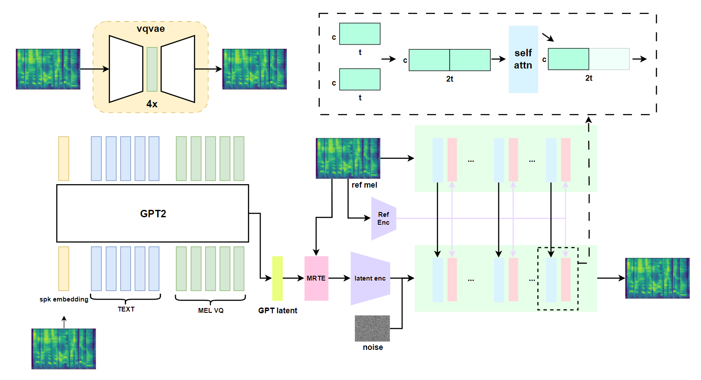

# TTTS(WIP)

This project is for training tortoise-tts like model.
Most of the codes are from [tortoise tts](https://github.com/neonbjb/tortoise-tts) and [xtts](https://github.com/coqui-ai/TTS/tree/dev/TTS/tts/layers/xtts).
The distinguishing factor lies in certain training details and the diffusion model. This repository employs the same architecture as animate-anyone, incorporating a referencenet for enhanced zero-shot performance.



Now only support mandarin.
Pretrained gpt and vae model can be found in [here](https://huggingface.co/adelacvg/TTTS/tree/main), you can use `api.ipynb` to get some intuition of these two models.

```
pip install . -e
```
Training the model including many steps.

### 1. Tokenizer training
Use the `ttts/prepare/bpe_all_text_to_one_file.py` to merge all text you have collected. To train the tokenizer, check the `ttts/gpt/voice_tokenizer` for more info.

### 2. VQVAE training
Use the `vad_asr_save_to_jsonl.py` and `save_mel_to_disk.py` to preprocess dataset.
Use the following instruction to train the model.
```
accelerate launch ttts/vqvae/train.py
```

### 3. GPT training
Use `save_mel_vq_to_disk.py` to preprocess mel vq. Run
```
accelerate launch ttts/gpt/train.py
```
to train the model.

### 4. Vocoder training
You can choose any one vocoder of the following. You must choose one, due to the output reconstructed by the vqvae has low sound quality.
#### 4.1 Hifigan
WIP
#### 4.2 Diffusion + vocos
I chose the pretrained vocos as the vocoder for this project for no special reson. You can swap to any other ones like univnet.

After change the config.json properly
```
accelerate launch ttts/diffusion/train.py
```

